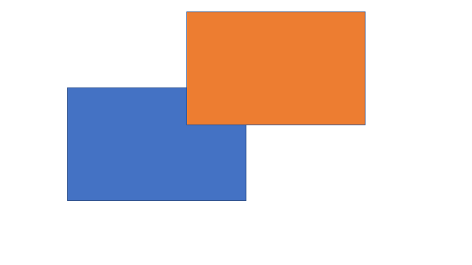
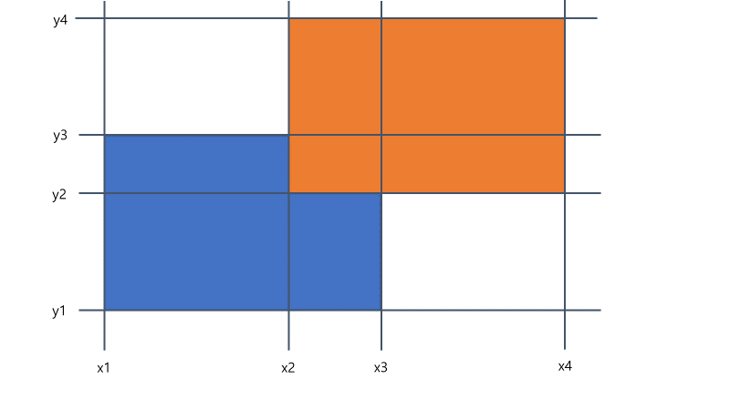
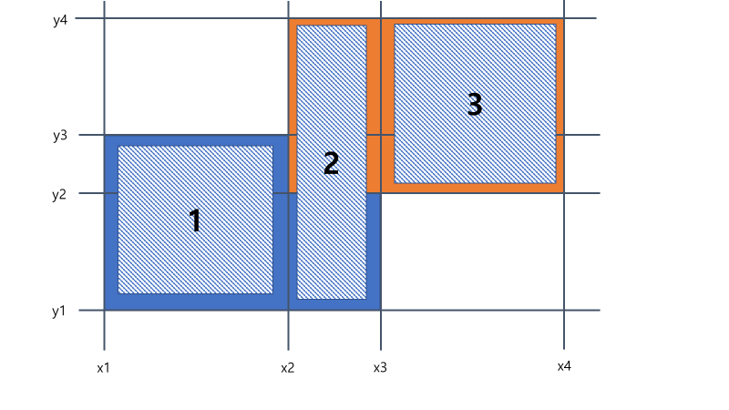

# 계산 기하 알고리즘 패턴

## 평면 스위핑
수평 또는 수직선으로 주어진 평면을 쓸고가면서 해결함

### 직사각형 합집합의 면적
직사각형의 합집합에서 y범위가 변하는 지점은 각 직사각형의 양끝 이므로, 
해당 이벤트들을 정렬하여 이벤트간의 거리 * 이벤트 간의 높이를 곱하여 더하면
전체 넓이를 구할 수 있음
 
<pre>
<code>
Class Rectangle {
	//x1&lt;x2, y1&lt;y2
	int x1,x2,y1,y2;
	Rectangle(int x1, int x2, int y1, int y2){
		this.x1=x1;
		this.x2=x2;
		this.y1=y1;
		this.y2=y2;
	}
}
Class Event {
	int x, is_left, rect_num;
	Event(int x, int is_left, int rect_num){
		this.x=x;
		this.is_left = is_left;
		this.rect_num = rect_num;
	}
}
int unionAres(List&lt;Rectangle&gt; rects){
	if(rects.size() == 0){
		return 0;
	}
	List&lt;Integer&gt; ys = new ArrayList&lt;>();
	List&lt;Event&gt; events = new ArrayList&lt;>();
	for(int i = 0; i &lt; rects.size(); i++) {
		ys.add(rects.get(i).y1);
		ys.add(rects.get(i).y2);
		events.add(new Event(rects.get(i).x1, 1, i);
		events.add(new Event(rects.get(i).x2, -1, i);
	}
	//y값 중복 제거후 정렬
	ys = new ArrayList&lt;&gt;(new HashSet&lt;Integer&gt;(ys));
	ys.sort(new Comparator&lt;Integer&gt;() {
		@Override
		public int compare(Integer arg0, Integer arg1) {
			return arg0-arg1;
		}
	});
	//event 정렬
	events.sort(new Comparator&lt;Event&gt;() {
		@Override
		public int compare(Event arg0, Event arg1) {
			return arg0.x-arg1.x;
		}
	});
	int ret = 0;
	//count[i] : ys[i]~ys[i+1]구간에 겹친 사각형의 수
	int[] count = new int[ys.size()-1];
	for(int i = 0; i < events.size(); i++) {
		Event event = events.get(i); 
		int x = event.x;
		int delta = event.is_left;
		int rect_num = event.rect_num;
		int y1 = rects.get(rect_num).y1;
		int y2 = rects.get(rect_num).y2;
		//count[j] 갱신
		for(int j = 0; j < ys.size(); j++) {
			if(y1 <= ys.get(j) && ys.get(j) < y2) {
				count[j] += delta;
			}
		}
		//겹친 부분의 y길이 계산
		int cutLen = 0;
		for(int j = 0; j < ys.size()-1; j++) {
			if(count[j] > 0) {
				cutLen += ys.get(j+1)-ys.get(j);
			}
		}
		//겹친 부분의 면적 더함
		if(i+1 < events.size()) {
			ret += cutLen * (events.get(i+1)-x);
		}
	}
	return ret;
}
</code>
</pre>

위 그림을 x값과 y값으로 나누면 다음과 같음

영역은 다음과 같은 순서대로 추가됨

이때의 count 배열은 다음과 같이 변함
 

|i|count[0]|count[1]|count[2]|count[3]|
|------|---|---|---|---|
|0|1|1|0|0|
|1|1|2|1|0|
|2|0|1|1|0|
|3|0|0|0|0|

### 다각형 교집합의 넓이 구하기
다각형의 꼭지점과 변들의 교차점을 모두 이벤트로 보면 두 이벤트 사이의 사다리꼴들을 모두 더하면
교집합의 넓이가 나옴

### 선분들의 교차 여부
각 선분의 끝점을 이벤트로 하면 교차점 이전의 이벤트에서는 두 선분 사이에 어떤 선분도 없음(샤모스-호이 알고리즘)
1. 수직선이 왼쪽 끝점을 만나면 집합에 추가되고, 오른쪽 끝점을 만나면 집합에서 제외됨
2. 새로운 선분이 추가될 때 마다 집합상에서 새선분과 인접한 두 선분의 교차여부 확인
3. 선분이 삭제될 때마다 집합상에서 새선분과 인접한 두 선분의 교차여부 확인

벤틀리-오트만 알고리즘은 교차여부 뿐만 아니라 모든 교차점을 구할 수 있음

## 회전하는 캘리퍼스

### 볼록 다각형의 지름
다각형을 평행한 두 직선 사이에 끼우고, 다각형을 따라 직선을 한바퀴 돌리면서 직선에 닿는 꼭지점들 간의 거리를 잼
직선을 시계 반대방향으로 돌렸을 경우 어느쪽이 먼저 다각형의 다른점과 만나는지 계산함.
그후 두 각도중 더 작은쪽을 택해 두 직선을 회전시킴
<pre>
<code>
double diameter(List&lt;Vector&gt; polygon) {
	int n = polygon.size();
	//가장 왼쪽에 있는 점
	int left = getMinElementIdx(polygon);
	//가장 오른쪽에 있는 점
	int right = getMaxElementIdx(polygon);
	Vector calipers = new Vector(0,1);
	double ret = polygon.get(left).minus(polygon.get(right)).norm();
	//다음 점까지의 방향을 나타내는 단위벡터
	List&lt;Vector&gt; toNext = new ArrayList&lt;&gt;();
	for(int i = 0; i < polygon.size(); i++){
		toNext.add(polygon.get((i+1)%n).minus(polygon.get(i)).normalize();
	}
	int a = left;
	int b = right;
	//반바퀴 돌아서 두 선분이 서로 위치를 바꿀때 까지 수행함
	while(a != right || b != left) {
		//a에서 다음점 까지와 b에서 다음점 까지의 각도가 어느것이 작은지 확인
		double cosThetaA = calipers.dot(toNext.get(a));
		double cosThetaB = calipers.mul(-1).dot(toNext.get(b));
		if(cosThetaA > cosThetaB) {
			calipers = toNext.get(a);
			a = (a+1)%n;
		} else {
			calipers = toNext.get(b).mul(-1);
			b = (b+1)%n;
		}
		ret = Math.max(ret, polygon.get(a).minus(polygon.get(b)).norm());
	}
	return ret;
}
</code>
</pre>